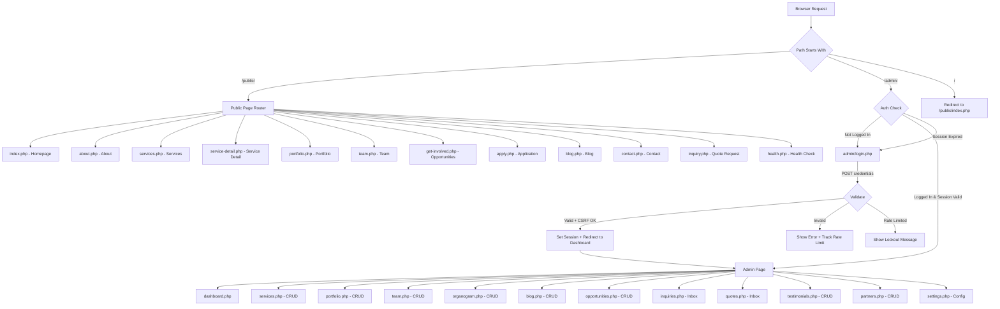
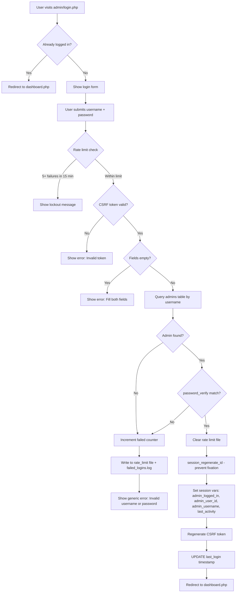
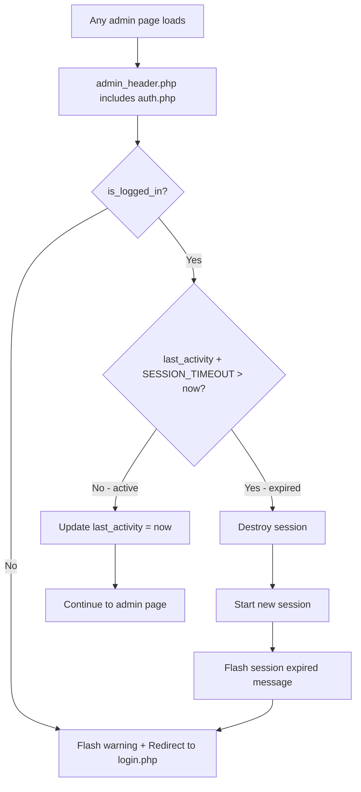
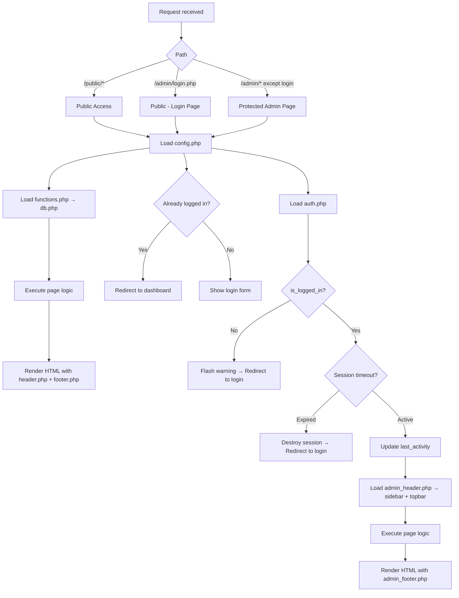

# 03 — Application Workflow

**Product:** MMCS Web Platform
**Last Updated:** 2026-07-14

---

## 1. Overall App Navigation Flow



---

## 2. Admin Login Flow



**Confirmed in code:** `admin/login.php:28-110`

---

## 3. Session Management Flow



**Confirmed in code:** `includes/auth.php:16-34`

---

## 4. User Flows Per Role

### 4.1 Public Visitor Flows

#### Flow: Browse Website
```
Homepage (index.php)
├── View hero banner, stats, services (top 6), testimonials, CTA
├── Click "Our Services" → services.php
│   ├── View all 9 services + EEPS explanation
│   ├── Click "Read Details" → service-detail.php?id=N
│   │   ├── View full service description
│   │   └── Click "Get Proposal Quote" → inquiry.php?service=TITLE
│   └── Click "Explore All Services" → services.php (same page)
├── Click "Portfolio" → portfolio.php
│   ├── Filter by sector (WASH, Education, Climate, etc.)
│   └── View project cards with client, year, description
├── Click "Our Experts" → team.php
│   └── View expert profiles with photos, roles, expertise tags
├── Click "Get Involved" → get-involved.php
│   ├── View opportunities grouped by type
│   └── Click "Apply Now" → apply.php?id=N
│       ├── View opportunity details + requirements
│       ├── Fill name, email, phone, cover letter, resume (PDF)
│       └── Submit → success message
├── Click "Blog" → blog.php
│   └── View published posts, download PDFs
├── Click "Contact" → contact.php
│   ├── Fill contact form (name, org, email, message)
│   ├── Submit → saves to inquiries table + email attempt
│   └── View office details + Google Map
├── Click "Get Quote" (CTA) → inquiry.php
│   ├── Fill detailed quote form
│   ├── Select service type from dropdown
│   ├── Select budget range
│   ├── Describe project scope
│   └── Submit → saves to inquiries table (type=inquiry) + email attempt
└── Footer links: About Us, Partners, Social media
```

#### Flow: Contact Form Submission
```
User navigates to contact.php
├── Fills: Name*, Org, Email*, Message*
├── Clicks "Submit Message"
├── Client-side: Bootstrap validates required fields + email
├── Server-side:
│   ├── CSRF token validated
│   ├── Required fields checked
│   ├── Email format validated via FILTER_VALIDATE_EMAIL
│   ├── INSERT INTO inquiries (name, org, email, message, type='contact', status='New')
│   ├── @mail() notification attempted (best-effort)
│   └── Flash success message
└── Page re-renders with success/error alert
```

#### Flow: Quote Request Submission
```
User navigates to inquiry.php (or via service-detail.php link with ?service=TITLE)
├── Fills: Name*, Org*, Email*, Service Type*, Budget Range, Message*
├── Service Type dropdown populated from active services table
├── Clicks "Submit Inquiry Request"
├── Server-side:
│   ├── CSRF token validated
│   ├── Required fields + email format checked
│   ├── INSERT INTO inquiries (..., type='inquiry', status='Pending', service_type, budget_range)
│   ├── @mail() notification attempted
│   └── Flash success message
└── Page re-renders with success/error alert
```

#### Flow: Job Application
```
User navigates to get-involved.php
├── Views open opportunities grouped by type (expert > intern > volunteer)
├── Clicks "Apply Now" on specific opportunity
├── apply.php?id=N loads (validates opportunity is open + deadline not passed)
├── If invalid → "Opportunity Not Found" page with back link
├── If valid:
│   ├── Shows opportunity details + requirements
│   ├── Fills: Name*, Email*, Phone, Resume (PDF), Cover Letter
│   └── Clicks "Submit Application"
│       ├── Server-side validation
│       ├── Resume uploaded via upload_file() to uploads/applications/
│       ├── INSERT INTO applications (opportunity_id, name, email, phone, cover_letter, resume_path)
│       └── Shows success card with links
```

### 4.2 Admin Flows

#### Flow: Content CRUD (Services, Team, Portfolio, Blog, Partners, Opportunities)
```
Admin clicks sidebar menu item
├── List View loads (default action)
│   ├── Fetches all records from corresponding table
│   └── Displays in table with Edit/Delete action buttons
├── "Add New" button → Form View
│   ├── Fills form fields
│   ├── Optional: uploads file (image or PDF depending on module)
│   ├── Clicks "Save"
│   │   ├── CSRF token validated via require_csrf_token()
│   │   ├── Required fields checked
│   │   ├── File upload validated (MIME type, extension, size)
│   │   ├── INSERT query executed
│   │   ├── Flash success message
│   │   └── Redirect back to list
│   └── Errors displayed inline
├── Pencil icon → Edit Form View
│   ├── Loads existing data into form
│   ├── Updates fields
│   ├── Clicks "Save"
│   │   ├── UPDATE query executed
│   │   └── Redirect back to list
│   └── Old file optionally replaced
├── Trash icon → Delete
│   ├── JavaScript confirm() dialog
│   ├── If confirmed:
│   │   ├── Associated file unlinked from filesystem
│   │   ├── DELETE query executed
│   │   ├── Flash success message
│   │   └── Redirect back to list
│   └── If cancelled: no action
```

#### Flow: Inquiries Management
```
Admin clicks "Inquiries & Msg" in sidebar
├── List View: all contact inquiries (type='contact') by date DESC
│   ├── New messages highlighted in yellow (table-warning)
│   ├── Currently viewed message highlighted in blue (table-primary)
│   └── Actions: View (eye icon), Delete (trash icon)
├── Click "Export CSV" → Downloads CSV file with all contact messages
├── Click "View" on message → Detail Panel
│   ├── Auto-marks "New" → "Read"
│   ├── Shows: sender name, org, email (with mailto link), message, date
│   ├── Status dropdown: New / Read / Replied
│   ├── "Compose Reply" button → opens email client via mailto:
│   └── "Back to Inbox" returns to list
└── Click "Delete" → confirm() → DELETE → redirect
```

#### Flow: Quotes Management
```
Admin clicks "Quote Requests" in sidebar
├── List View: all inquiries (type='inquiry') by date DESC
│   ├── Pending quotes highlighted in yellow
│   └── Actions: View, Delete
├── Click "View" on quote → Detail Panel
│   ├── Auto-marks "Pending" → "In Progress"
│   ├── Shows: client info, service type, budget, email, message, date
│   ├── Status dropdown: Pending / In Progress / Closed
│   ├── "Print / Save PDF" → Opens print-friendly page with auto-print
│   └── "Reply Quote" → opens email client via mailto:
└── Click "Delete" → confirm() → DELETE → redirect
```

#### Flow: Site Settings Update
```
Admin clicks "Site Settings" in sidebar
├── Left Panel: Global Configuration Form
│   ├── Loads all current settings from DB
│   ├── Admin edits fields (company name, phone, email, addresses, social links, stats, footer text, consultation fee)
│   ├── Clicks "Save Changes"
│   │   ├── CSRF validated
│   │   ├── Transaction begins
│   │   ├── INSERT ... ON DUPLICATE KEY UPDATE for each setting
│   │   ├── Transaction committed
│   │   └── Success message shown
│   └── Public site reflects changes on next page load
└── Right Panel: Security Gate (Password Change)
    ├── Enter current password
    ├── Enter new password (min 12 chars, 3 of 4 character classes, no username or site words)
    ├── Confirm new password
    ├── Click "Change Password"
    │   ├── Current password verified via password_verify()
    │   ├── New hash generated via password_hash()
    │   ├── Admins table updated
    │   └── Session refreshed
    └── Error/success message shown
```

---

## 5. Admin vs Public Permission Flow



**Key distinction:** Public pages have no auth gate. Admin pages are protected by `includes/auth.php` which is included via `admin/admin_header.php`. The login page itself is the only admin page that doesn't require auth.

---

## 6. Data Flow Diagrams

### 6.1 Contact Form → Database → Admin UI

```mermaid
flowchart LR
    A[Public Form<br>contact.php] -->|POST + CSRF| B[Server Validation]
    B -->|Valid| C[PDO INSERT<br>inquiries table]
    B -->|Invalid| D[Error Message]
    C -->|Best-effort| E[mail&#40;&#41; Notification]
    C --> F[Flash Success]
    F --> G[Page Re-render]
    
    H[Admin views<br>inquiries.php] -->|SELECT| C
    C --> I[List View<br>Status badges]
    I -->|Click View| J[Detail Panel]
    J -->|Auto-status change| K[UPDATE status<br>New → Read]
    J -->|Manual change| L[UPDATE status<br>via dropdown]
    J -->|Export| M[CSV Generation<br>fputcsv]
```



### 6.2 File Upload Flow (Team Member Photo)

```mermaid
flowchart TD
    A[Admin Form<br>POST multipart/form-data] --> B{$_FILES check}
    B -->|No file| C[Use existing photo path]
    B -->|File uploaded| D{upload_file&#40;&#41; validation}
    D -->|Size > 5MB| E[Flash error]
    D -->|Invalid MIME type| E
    D -->|Invalid extension| E
    D -->|Valid| F[Create uploads/team/ if needed]
    F --> G[Generate unique filename]
    G --> H[move_uploaded_file]
    H -->|Success| I[Return relative path]
    H -->|Failure| E
    
    I --> J[PDO INSERT/UPDATE<br>team_members table]
    C --> J
    
    K[DELETE team member] --> L[SELECT photo path]
    L --> M{Path != default?}
    M -->|Yes| N[unlink&#40;&#41; old file]
    M -->|No| O[Skip]
    N --> P[DELETE FROM team_members]
    O --> P
```



### 6.3 Application Submission Flow

```mermaid
flowchart TD
    A[Public: apply.php?id=N] --> B{Opportunity valid?}
    B -->|Not found / expired| C["Not Found" page]
    B -->|Valid| D[Show form + opportunity details]
    D --> E[User submits form]
    E --> F{Server validation}
    F -->|Name/Email empty| G[Error message]
    F -->|Invalid email| G
    F -->|Valid| H{Resume uploaded?}
    H -->|Yes| I[upload_file&#40;&#41; → uploads/applications/]
    H -->|No| J[resume_path = null]
    I -->|Upload failed| G
    I -->|Success| K[INSERT INTO applications]
    J --> K
    K --> L[Show success card]
```



---

*All flows are traced from actual code paths. File references confirm each step.*
